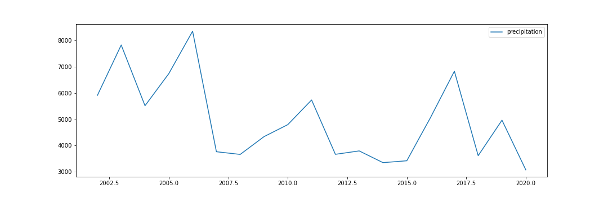

# Precipitation-Project

 Wep Scrapping from https://www.cnrfc.noaa.gov/ and Data Visualization

## Purpose of this project
These days, it is obvious to see extreme weather change. Many natural disasters have been occurring throughout the whole world. Even though we could easily encounter these disastrous news through a lot of media, it seems that many people do not recognize the seriousness of the situation. For example, drought have been an issue in United States for a long time, but people's lifestyle have not changed. They still use a lot of water and while they are using it, they do not consider how urgent the situation is. 

I thought people do not consider and take it lightly because they just heard about it from someone else. I believed that if they see something visual that shows how the earth's environment is going on right now since past few years, they might have taken it heavier and recognized the situation properly. Therefore, I decided to web-scrape from official government precipitation website and visually help them to understand the situation easily.

## Web Scraping

 Used Library: BeautifulSoup4, csv

 By using 'beautifulsoup4' library, scrapper scrapped all the rows of the table from https://www.cnrfc.noaa.gov/ and saved it to csv file using 'csv' library. Each row consists of the ID(ID of location), location name and precipitations for each month. While scrapping, I decided to exclude rows which had 'M' in index because all the rows that had 'M' in the index had missing value for 'Total WY' and 'Pct Avg to Date'. 'Total WY' column and having missing data points were crucial to analyze the data.

 ## Data Visualization

 Used Library: pandas, matplotlib, numpy, and seaborn

 Usually I use all of the libraries above when I do something with the data, but this time I was able to use only pandas and matplotlib libraries. Detailed comments, explanation of the process and analysis on the data and graphs are on the notebook!
 
### Image #1

Image #1 shows the precipitation of the whole locations from 2002 to 2019. This graph illustrates that there are few locations that have regular cycle of precipitation, going up and down periodically and some locations remain low during the whole period. However, it is still hard to see the detailed statistical importance because of the high variety of locations.

### Image #2

Image #2 illustrates the precipitation of the whole regions. Added all the location's total precipitation by monthly. Since we could not extract statistical information by referring all the locations, I thought it would be better to illustrate the whole state's precipitation to see it's precipitation condition in general.

### Image #3

Image #3 illustrates the precipitation of certain location where represents the surrounding areas. I had selected these locations by selecting where had mean amount of precipitation among the neighboring locations. From these graph I was able to see that except for few locations, most of the locations had a downside of precipitation recently. It was crucial to see the limit of y-axis for each graph. Each graph had different limit of y-axis, so it would cause a misinterpretation from just looking at the slope of the graphs. After observing the y-axis limit, most of the area's highest precipitation was between 11 to 40 which supports the argument that California is in a severe drought.

#### More details about the graphs, data, and the process of data preprocessing are in JupyterNotebook file in the repository!
